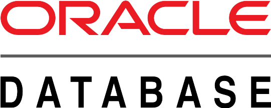

  

  

 

<h1 align="center">Hi , I am Van Tran Y </h1>
<h3 align="center">Software Engineer | Data Engineer </h3>

  

 

  <em>
    Hello, I am Van Tran Y a <b>final year</b> undergraduate from <a href="https://uom.lk/"> <b> Ho Chi Minh City University of Science</b></a>.  
    <b>a passionate self-learner</b>  <b>a Data Engineer</b>  <b>Software Engineer</b>&nbsp;&nbsp;, who is <b>obsessed</b>
    with <b>Software development</b> and <b>Data Enginering</b> and always looking to find solutions to power up the systems in real world. 
  </em> 
   

  

&nbsp;<em><strong>About me …</strong></em>

✔ Callme: <em><strong>He/His</strong></em> or <em><strong>TeamWorker</strong></em> 😊  
✔ I’m currently Developing a Meal Planner Application to provide interesting ways for people who need to track the <strong>nutrition</strong> per meal. It also bring a <strong>recommender system</strong>, which answers our daily question <strong>"What should I eat today?"</strong>.
 
✔ I’m currently learning about <strong>microservices architecture</strong>🥰 
✔ Ask from me anything you want, If I am alive I will answer within seconds 😉 
    

&nbsp;<em><strong>My working tools…</strong></em>

<code></code>
<code>  </code>
<code>  </code>
<code>  </code>
<code>  </code>
<code>  </code>
<code>  </code>
<code>  </code>
<code>  </code>
<code>  </code>
<code>  </code>
<code>  </code>
<code>  </code>
<code>  </code>
<code>  </code>
<code>  </code>
<code>  </code>
<code>  </code>

  

  

 &nbsp;<i><b>Git Activeness</b></i>

&nbsp;

     

&nbsp;Git profile Trophies
 

Credits: <a href="https://github.com/TranYVan">TranYVan</a>

Last Edited on: 10/12/2024

